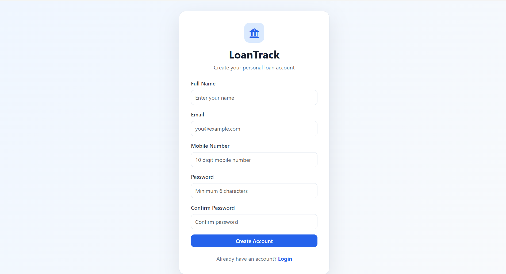
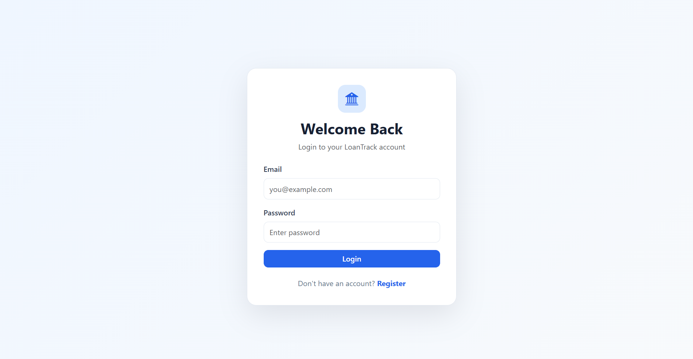
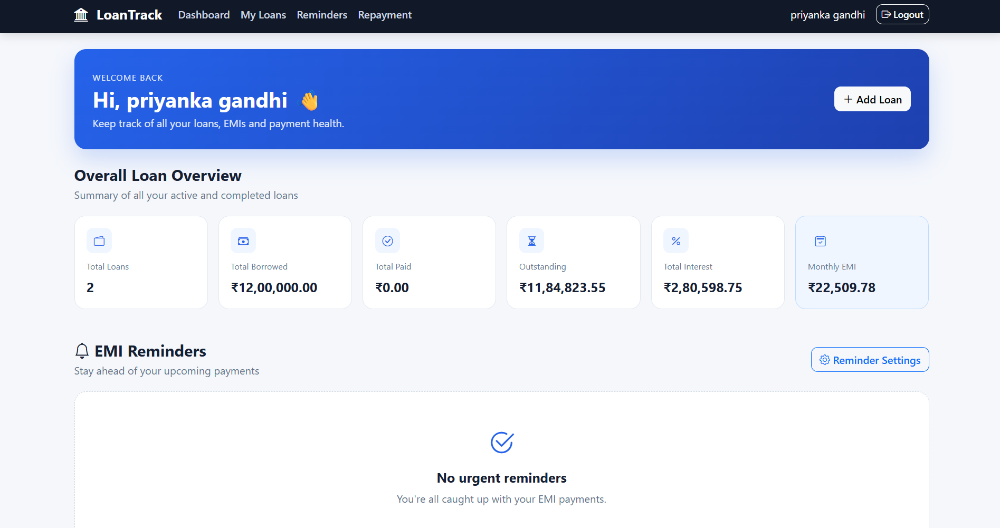
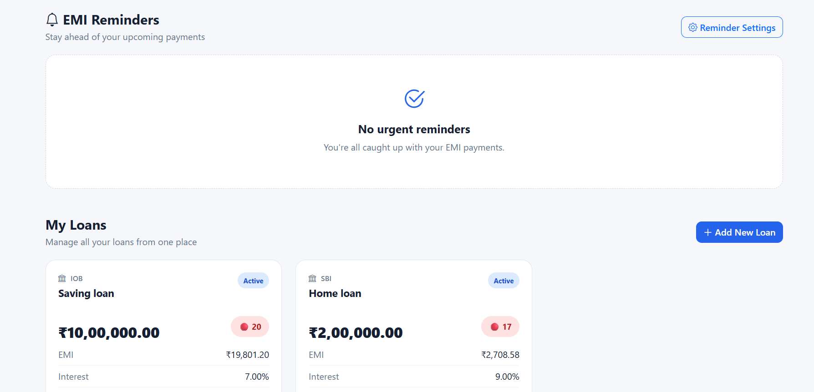
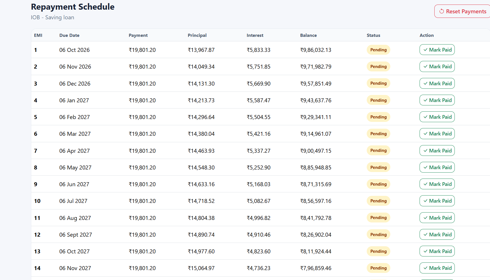

💰 LoanTrack – Personal Loan Management System

📌 Project Description

LoanTrack is a responsive Personal Loan Management System developed to help users manage their loan information, calculate EMIs, track repayments, monitor outstanding balances, and stay organized with their loan commitments through a simple and user-friendly interface.

🔴 Problem Statement

Managing personal loans manually can be difficult and time-consuming. Users may face challenges in calculating EMIs, tracking payment due dates, monitoring outstanding balances, and keeping repayment information organized. LoanTrack provides a centralized platform to make loan management easier and more efficient.

📖 Synopsis

LoanTrack is a web-based application designed to provide users with a simple platform for managing personal loan information. Users can view loan details, calculate EMI information, monitor repayment schedules, track payment status, and check their outstanding loan balance.

The project focuses on providing a clean, responsive, and user-friendly interface for effective personal loan management.

🛠️ Technologies Used

- HTML5
- CSS3
- Bootstrap 5
- JavaScript
- LocalStorage

✨ Features

- 🔐 User Registration
- 🔑 User Login
- 🏠 Loan Dashboard
- 💳 Loan Management
- 🧮 EMI Calculator
- 📅 Repayment Schedule
- 💰 Payment Tracking
- 🔔 Payment Reminders
- 📊 Loan and EMI Overview
- 📈 Outstanding Balance Tracking
- 📋 Loan Details
- 📱 Responsive Design
- 🎨 User-Friendly Interface
- 🚀 Easy Navigation

⚠️ Problems Faced During Development

- Designing a simple interface for displaying multiple loan details.
- Presenting EMI and repayment information clearly.
- Creating an organized repayment schedule.
- Managing payment status and loan information.
- Making the interface responsive across different screen sizes.
- Organizing financial information without making the dashboard complicated.

💡 How I Solved the Problems

- Designed separate sections for different loan-related information.
- Used cards and structured layouts to display financial summaries clearly.
- Created an organized repayment interface for easy payment tracking.
- Used JavaScript to handle dynamic calculations and user interactions.
- Implemented responsive design using CSS and Bootstrap.
- Used LocalStorage to maintain relevant user and loan information on the frontend.

## 📸 Screenshots

### 📝 Register Page

### 🔐 Login Page

### 🏠 Dashboard Page

### 🔔 Reminder Page

### 💳 Loan Page 1

### 💳 Loan Page 2

### 💰 Repayment Page

🔮 Future Enhancements

- Backend integration using Node.js, Express.js, or Java Spring Boot
- MongoDB or MySQL database integration
- Secure user authentication
- EMI due-date notifications
- Email and SMS payment reminders
- Online EMI payment integration
- PDF loan statement generation
- Advanced financial analytics
- AI-based loan repayment recommendations
- Mobile application
- Cloud deployment

📄 License

This project is created for educational and academic purposes.

👤 Author

Priyanka Gandhi

GitHub: "PriyankaGandhi24116" (https://github.com/PriyankaGandhi24116)

LinkedIn: "Priyanka Gandhi" (https://www.linkedin.com/in/priyanka-gandhi-80abaa430/)

📝 Conclusion

LoanTrack provides a simple and user-friendly platform for managing personal loan information, EMI details, repayments, reminders, and outstanding balances. The project demonstrates the practical use of HTML, CSS, Bootstrap, JavaScript, and LocalStorage to develop a responsive financial management application.

With future backend, database, notification, and AI integration, LoanTrack can be developed into a complete and intelligent personal loan management platform.
